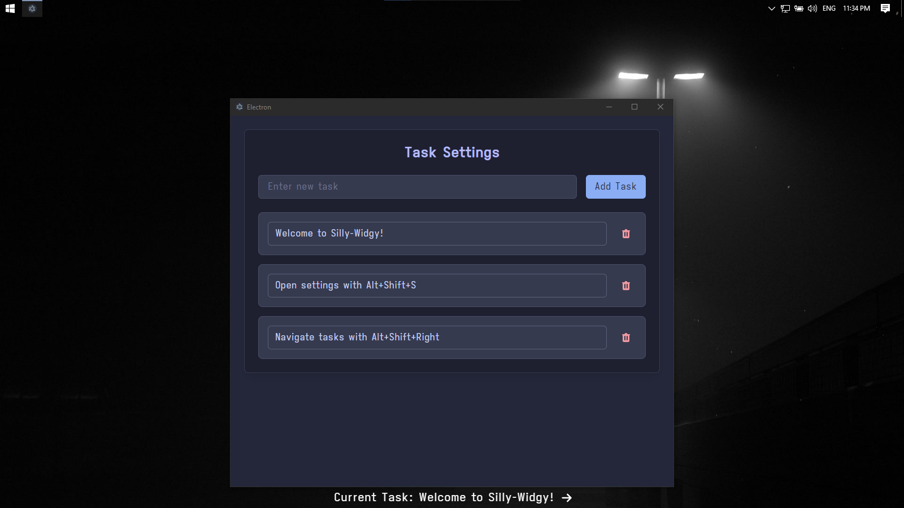

# 🪄 Silly-Widgy

A minimal, elegant task widget that stays out of your way while keeping you on track.



## ✨ Features

### Core Functionality
- 🎯 **Always-on-top Widget** - Displays your current task in a sleek, minimal bar
- 🔄 **Task Rotation** - Cycle through tasks with `Alt+Shift+Right`
- ⚡ **Quick Settings** - Access settings instantly with `Alt+Shift+S`
- 🖱️ **Click-through Design** - Widget doesn't interfere with your workspace

### Task Management
- ➕ **Easy Task Addition** - Add tasks quickly through the settings panel
- 📝 **In-place Editing** - Edit tasks directly in the settings view
- 🗑️ **Quick Remove** - Remove tasks with a single click
- 🔄 **Real-time Updates** - Changes reflect immediately across the app

### User Interface
- 🎨 **Catppuccin Theme** - Beautiful Macchiato color scheme
- 🔤 **Custom Typography** - Sleek Iosevka Aile monospace font
- 💫 **Smooth Animations** - Polished transitions and hover effects
- 🎯 **Focus States** - Clear visual feedback for keyboard navigation

### Technical Features
- ⚛️ **Built with Electron & React** - Modern, responsive, and maintainable
- 🎨 **TailwindCSS** - Utility-first CSS for consistent styling
- 🔒 **Secure IPC Communication** - Safe main process to renderer communication
- 📱 **Responsive Design** - Adapts to different screen sizes

## ⌨️ Keyboard Shortcuts

| Shortcut | Action |
|----------|--------|
| `Alt+Shift+Right` | Next Task |
| `Alt+Shift+S` | Open Settings |

## 🚀 Getting Started

### Prerequisites
- Node.js (v14 or higher)
- npm or yarn

### Installation

```bash
# Clone the repository
git clone https://github.com/x1nx3r/silly-widgy.git

# Navigate to project directory
cd silly-widgy

# Install dependencies
npm install

# Start the development server
npm run dev
```

### Building

```bash
# Build for production
npm run build
```

## 🎨 Customization

### Themes
The app uses the Catppuccin Macchiato theme by default. Colors are defined in:
```css
src/renderer/src/assets/main.css
```

### Configuration
Tasks can be managed through the settings panel (Alt+Shift+S)

## 📝 License

This project is licensed under the MIT License - see the [LICENSE](LICENSE) file for details.

## 🤝 Contributing

Contributions are welcome! Please feel free to submit a Pull Request.

1. Fork the repository
2. Create your feature branch (`git checkout -b feature/AmazingFeature`)
3. Commit your changes (`git commit -m 'Add some AmazingFeature'`)
4. Push to the branch (`git push origin feature/AmazingFeature`)
5. Open a Pull Request

## 🙏 Acknowledgments

- [Electron](https://www.electronjs.org/)
- [React](https://reactjs.org/)
- [TailwindCSS](https://tailwindcss.com/)
- [Catppuccin](https://github.com/catppuccin/catppuccin) for the beautiful color scheme
- [Iosevka](https://typeof.net/Iosevka/) for the elegant typeface


Made with ❤️ and probably too much ☕
